# Shokonotes

**Your notes are files. Shokonotes is what you use to find them.**

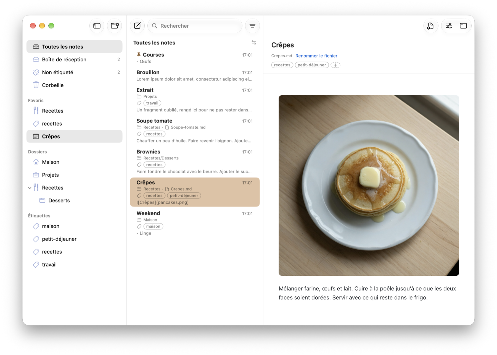

## Genesis

For years I looked for a note-taking app I could settle into. The choice is wide, and I spent real time with most of them. Every one failed me on at least one point:

- **A subscription you cannot leave.** Stop paying and you do not just lose the app, but the filing, the tags, the years of triage that made the notes worth keeping.
- **A proprietary database.** Your notes become rows in a format only one company can read. You hand your privacy, your security and your future access to a third party, and you have no way to audit any of it.
- **No clear path from a thought to a filed note.** Capture is fast or organising is good, rarely both, and never without friction between them.
- **Cross-platform compromises.** One codebase for five systems means an app that is at home on none of them. On a Mac it shows immediately.
- **Markdown treated as an afterthought.** Editing or preview that is incomplete, or quietly wrong.

**Credit where it is due.** [Typora](https://typora.io) showed me what writing Markdown should feel like. Shokonotes does not try to replace it: it finds and reads your notes, and hands the writing back to Typora, or to whatever editor you already love.

I knew exactly what I wanted. I was not a developer. AI coding agents changed that.

I designed Shokonotes; the code was written with their help.

## What Shokonotes is built on

**Do few things, do them well.** Shokonotes focuses on finding, reading and organising your Markdown notes. Real use and feedback guide what comes next.

**Your notes are yours.** Plain Markdown files, in a folder you pick. No database, no account, no server, no telemetry. Sync is your call: iCloud, Nextcloud, Syncthing, Mega, a Git repository, or nothing at all.

**Your library, your editor.** In the current version, editing on the Mac happens in an external editor. Shokonotes opens the one you choose — Typora, VS Code, Sublime Text, Neovim, TextEdit — and picks up your changes when you save. You can keep your writing habits while using Shokonotes to find, read and organise your notes.

<p align="center">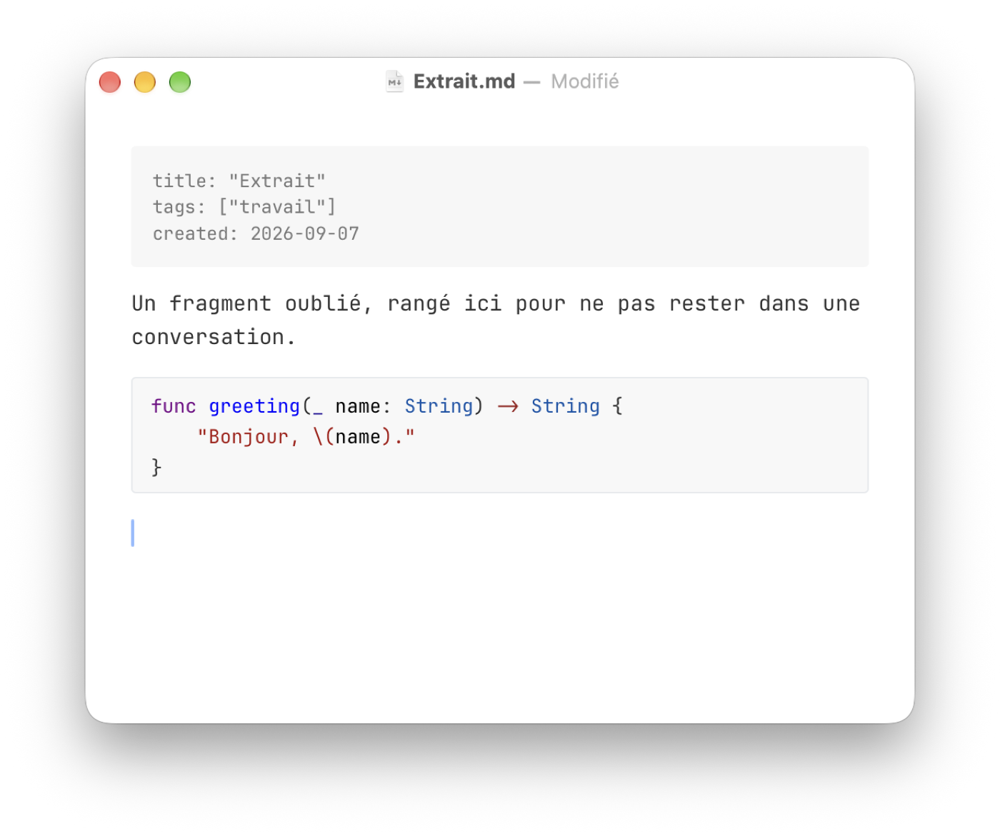</p>

**Capture first, file later.** A global shortcut (Control-Option-Command-N by default) creates a note in **Inbox** and opens your editor, without bringing the library window forward or losing what you were reading. The thought lands; sorting is a separate moment, on your terms. It is the GTD inbox, applied to notes.

**Search that answers while you type.** Full text, across the whole library.

**Folders and tags are not rivals.** Folders separate your activities. Tags cut across them. You need both, and you should not have to choose a religion.

**Native, and only native.** SwiftUI and AppKit, one sandboxed binary, macOS 14+. It behaves like a Mac application because it is one.

**The phone is not the Mac.** On iPhone you look things up and you catch a line before it escapes. Search, read, capture to Inbox, share a page from Safari. Filing a library is desk work, and the iPhone app does not pretend otherwise.

<p align="center">
  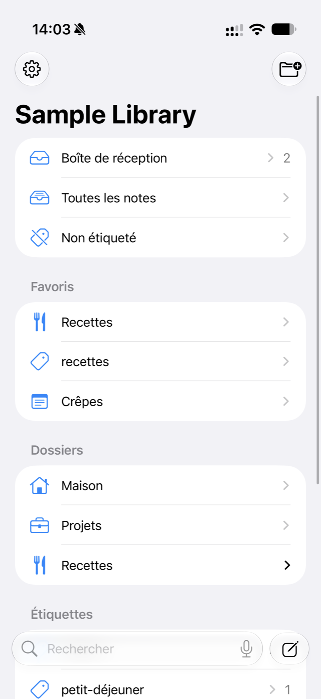
  
  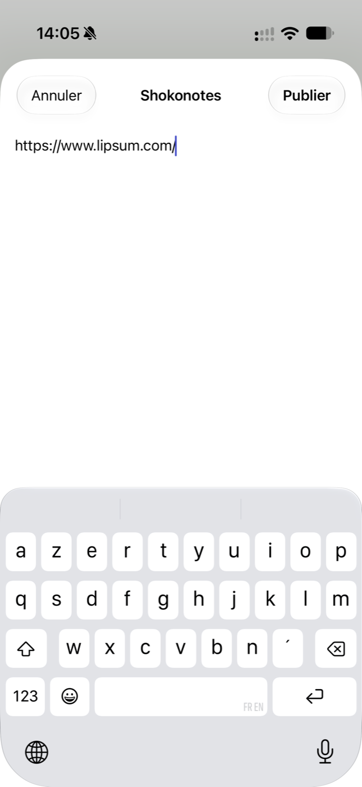
</p>

## What Shokonotes will never do

No AI writing in your notes. No cloud of ours. No account. No subscription.

## Get Shokonotes

**Mac and iPhone: one purchase on the App Store.** Buy Shokonotes once and you get both apps. [Get it on the App Store](https://apps.apple.com/app/id6816433175)

**Or build it yourself.** Shokonotes is free software under the GPLv3: the full source is here, and [Building from source](#building-from-source) takes a few minutes with Xcode.

Shokonotes is one person's work, paid for out of pocket — the Apple developer account, the AI agents that wrote the code, and the evenings. If it earns a place in your day, buying it is what keeps it maintained.

## Feedback

Shokonotes is shaped by use, and yours counts. Bug reports, rough edges, confusing wording and feature suggestions are all welcome: write to [shokonotes@phocean.net](mailto:shokonotes@phocean.net), see the [support page](https://phocean.github.io/shokonotes/support.html), or [open an issue](https://github.com/phocean/shokonotes/issues).

Two things worth knowing before you write. It is one person answering, so give me a few days. And "do few things, do them well" means some suggestions will get a friendly no — that is not dismissal, it is the reason the app stays small enough to be good at what it does.

---

## How it works

### Your library is a folder

Point Shokonotes at a folder of Markdown files. That folder is the truth: nested folders are folders, and there is no import step, no index you have to rebuild, no copy of your notes kept somewhere else. Edit a file in any other app and Shokonotes notices within the second.

Each note may carry YAML front matter. When updating an existing note, the current version of Shokonotes changes only these three metadata keys, leaving the body untouched:

```markdown
---
title: Quarterly review
tags: [work, planning]
created: 2026-09-18
---

The rest of the file is yours.
```

A note without front matter still works. Nothing is required.

### On the Mac

The sidebar gathers **Inbox**, **All Notes**, **Untagged**, **Trash**, your nested folders, your YAML tags and your favourites. New notes land in the folder you have selected.

A global shortcut creates a note in Inbox and opens your editor **without bringing the library forward**. Your search, your selection and what you were reading are untouched. A second shortcut brings the library to the front, and hides it again if it is already there. Both work from any app, and you can change them in Settings.

By default, **Control-Option-Command-N** is the quick note, and **Control-Option-Command-S** shows or hides the library. Inside the window, Command-N makes a note in the folder you have selected, Command-F searches, Command-P prints, and Return opens the current note in your editor.

Typora is offered as a default when it is installed; any editor does. Notes can be pinned, tagged, moved, printed, exported to PDF, shared, or revealed in Finder. The trash restores a note to the folder it came from. Closing the window leaves Shokonotes running in the Dock, with its shortcuts alive, unless you prefer it to quit.

Tag suggestions are counting, not a model: Shokonotes only ever proposes tags you already use, based on how you have used them. No network, no learning, and it never speaks first.

<p align="center">
  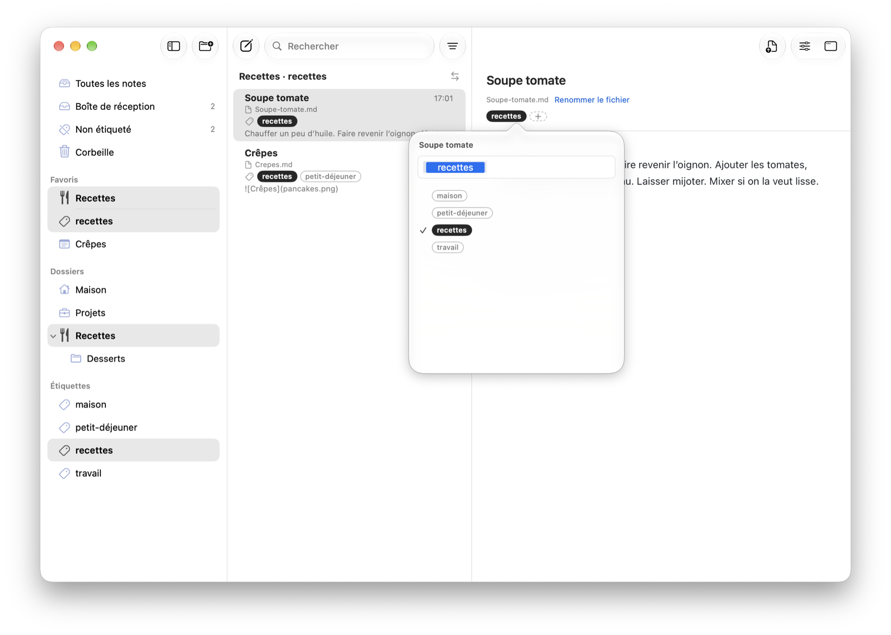
  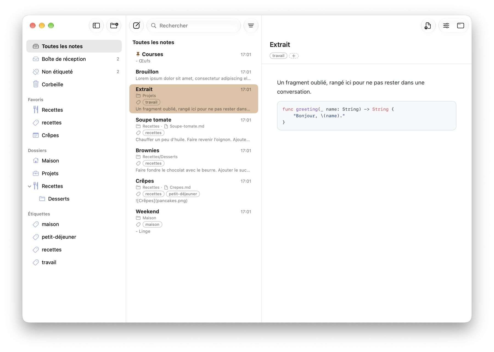
</p>

### On the iPhone

The iPhone app opens **the same folder, provided it lives in iCloud Drive**. You pick it once through the Files app.

Other providers are not blocked, so the picker will let you choose one, but they are untested, and nothing about them is promised.

It is built for looking things up and catching a line: search, read, capture to Inbox, and a share extension so a page from Safari or a line from Mail becomes a note without leaving the app you are in. Tags, move, pin, trash and creating a folder are there; filing a library properly is desk work.

Capture creates a new note: one field, no toolbar, no preview. Editing existing notes is not available on the phone in the current version.

<p align="center">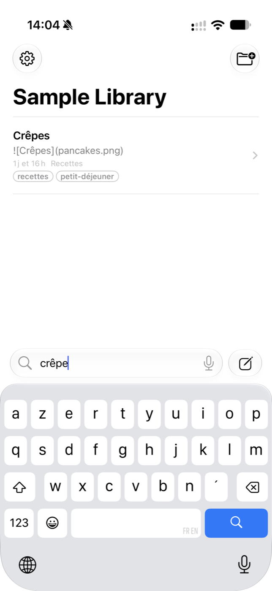</p>

### Rendering

Preview is GitHub Flavored Markdown, rendered on the device with [cmark-gfm](https://github.com/swiftlang/swift-cmark), with syntax highlighting. Nothing is sent anywhere: the Mac app is sandboxed without any network entitlement, so macOS itself guarantees it cannot reach the network.

macOS 14+ or iOS 17+  : one sandboxed binary per platform.

### Languages

Shokonotes follows the language of your Mac or iPhone. It currently speaks English, French, German, Spanish, Italian, Japanese, Korean, Brazilian Portuguese, Russian and Simplified Chinese. Menus that belong to the system (Share, print, the Dock) keep Apple’s own wording in that language.

<table>
  <tr>
    <td>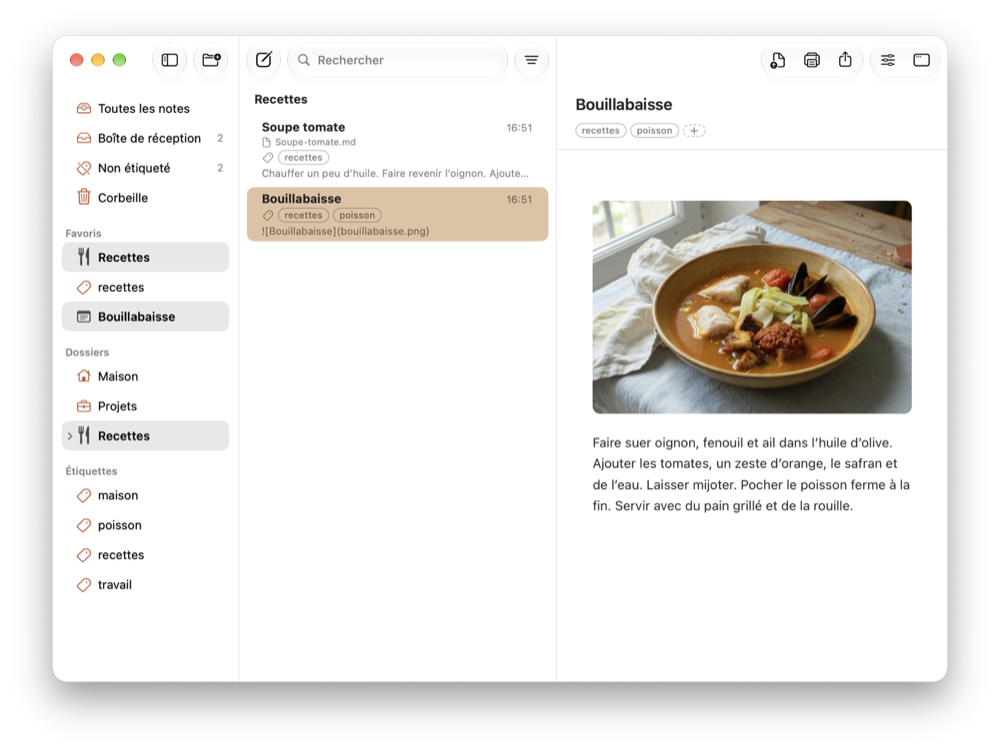</td>
    <td>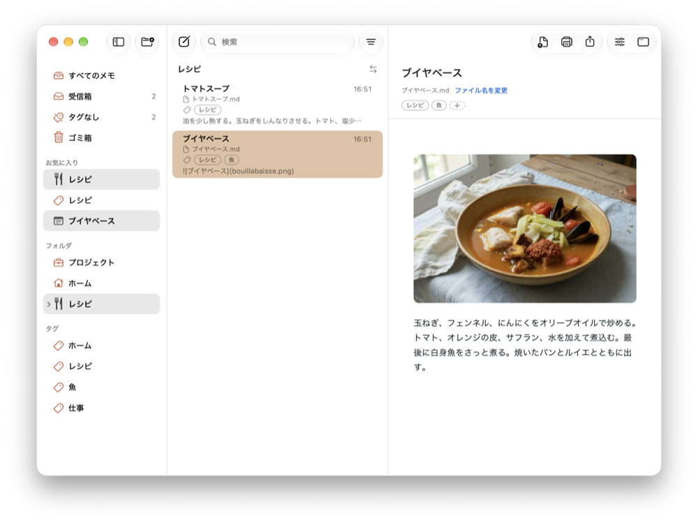</td>
  </tr>
  <tr>
    <td align="center">Français</td>
    <td align="center">日本語</td>
  </tr>
  <tr>
    <td>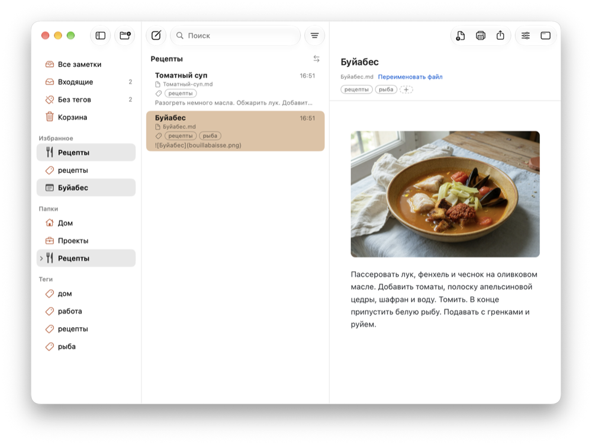</td>
    <td>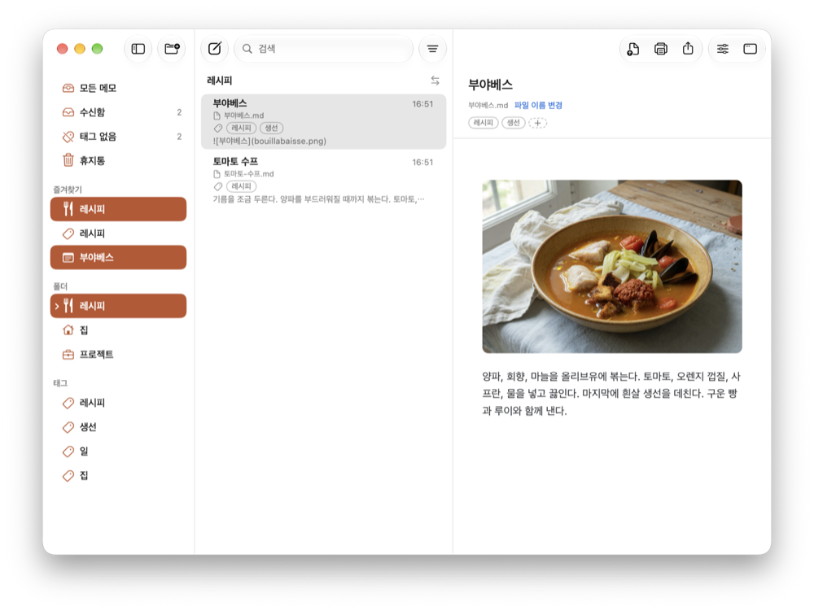</td>
  </tr>
  <tr>
    <td align="center">Русский</td>
    <td align="center">한국어</td>
  </tr>
</table>

---

## Building from source

Xcode 26 or later (the app icon is an Icon Composer `.icon` bundle) and [XcodeGen](https://github.com/yonaskolb/XcodeGen).

```bash
brew install xcodegen
make build      # Mac
make test
make ios        # iPhone simulator
```

`make install` copies the Mac app to `/Applications`. `make install-ios` signs the iPhone app and installs it on a connected device.

| | Mac | iPhone |
|---|---|---|
| Bundle ID | `com.jcbaptiste.shokonotes` (universal purchase) | `com.jcbaptiste.shokonotes` |
| Requires | macOS 14+ | iOS 17+ |

## Credit

I designed this application. The code was written with the help of AI agents.

## Licence

GNU General Public License v3.0 — see [LICENSE](LICENSE). Copyright © 2026 Jean-Christophe Baptiste.

The App Store builds are distributed by the copyright holder. Contributions: see [CONTRIBUTING.md](CONTRIBUTING.md).
